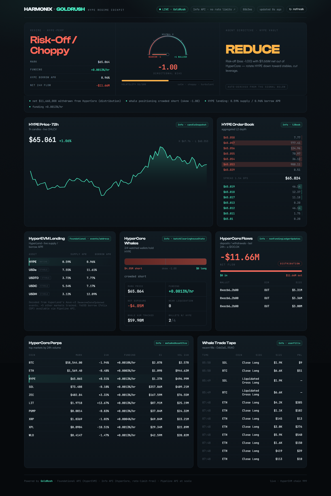

# hypersignal

**A GoldRush-powered Hyperliquid signal engine for AI yield agents.**

`hypersignal` turns three on-chain data feeds — HyperEVM lending rates, HyperCore whale positioning, and large stablecoin/HYPE flows — into a single, explainable **HYPE regime signal** that an allocation agent can act on directly.

It is built entirely on the [GoldRush](https://goldrush.dev/docs) APIs, so it scales past the public Hyperliquid rate limits: the [Info API](https://goldrush.dev/docs/goldrush-hyperliquid/info-api/overview) is a drop-in, **rate-limit-free** replacement for `api.hyperliquid.xyz/info`, and the [Foundational API](https://goldrush.dev/docs/chains/hyperevm) indexes HyperEVM directly.



> The screenshot above is **live** data: the bias gauge, lending APRs, whale skew, and HyperCore flows are all pulled through GoldRush in real time. See [`dashboard/`](dashboard/).

---

## Why this exists

This demo was scoped for a team running an AI agent that allocates across Hyperliquid lending markets (Felix, HyperLend) off a small set of cron-pulled data points. The three things they wanted to track:

1. **On-chain HyperEVM lending rates** for HYPE and stablecoins.
2. **Whale positioning on HyperCore** — a read on whether HYPE is set up to be volatile.
3. **Large deposits/withdrawals** of stablecoin/HYPE in and out of HyperEVM/HyperCore.

`hypersignal` does all three and fuses them, so the agent consumes one JSON object instead of stitching together raw feeds.

## How each use case maps to GoldRush

| Use case | Module | GoldRush endpoint | What it produces |
|---|---|---|---|
| **1. Lending rates** | [`lending.py`](src/hypersignal/lending.py) | Foundational API `GET /v1/hyperevm-mainnet/events/address/{pool}/` | Decodes HyperLend's Aave-v3 `ReserveDataUpdated` events into live **supply / borrow APR** per reserve (HYPE, USDe, USDT0, USDC, USDH) |
| **2. Whale positioning** | [`whales.py`](src/hypersignal/whales.py) | Info API `metaAndAssetCtxs` + `batchClearinghouseState` | Net whale HYPE exposure, **skew**, crowding, liquidation clustering, funding |
| **3. Large flows** | [`flows.py`](src/hypersignal/flows.py) | Info API `userNonFundingLedgerUpdates` | Large deposits/withdrawals over a window → **net flow direction** (accumulation vs distribution) |
| **Fusion** | [`signal.py`](src/hypersignal/signal.py) | — | `directional_bias ∈ [-1,1]`, `volatility_score ∈ [0,1]`, regime label, plain-English drivers |

> **On rates, precisely:** HyperLend is an Aave v3.0.2 friendly-fork. Its Pool emits `ReserveDataUpdated(reserve, liquidityRate, …, variableBorrowRate, …)` on every interaction, with rates in RAY (1e27). `hypersignal` reads those events through GoldRush and computes `APR% = rate / 1e27 × 100` — the *exact* on-chain rate, market-wide, in one request. Felix mints feUSD against HYPE collateral (a CDP, not an Aave pool), so it has no rate feed; feUSD is tracked as a stablecoin of interest.

## Quickstart

```bash
git clone https://github.com/dinxsh/hypersignal
cd hypersignal
python -m venv .venv && source .venv/Scripts/activate   # Windows: .venv\Scripts\activate
pip install -e ".[dev]"

# Run against recorded fixtures — no API key needed:
hypersignal signal --offline
```

Example output:

```json
{
  "coin": "HYPE",
  "directional_bias": 0.876,
  "volatility_score": 0.571,
  "regime": "risk-on / choppy",
  "drivers": [
    "net $1,900,000 deposited into HyperCore (accumulation)",
    "whale positioning crowded long, longs paying funding (squeeze risk down) (skew +0.76)",
    "1 whale position(s) within 10% of liquidation",
    "HYPE lending: 3.40% supply / 6.10% borrow APR",
    "funding +0.0013%/hr"
  ],
  "hype_supply_apr": 3.4,
  "hype_borrow_apr": 6.1,
  "funding_rate": 1.25e-05,
  "whale_skew": 0.765,
  "net_flow_usd": 1900000.0
}
```

## Live mode

Get a key at [goldrush.dev](https://goldrush.dev) and export it:

```bash
export GOLDRUSH_API_KEY=cqt_...
hypersignal report          # full report: signal + every snapshot
hypersignal lending         # just the lending rates
hypersignal whales          # just whale positioning
hypersignal flows           # just the flow events
```

Edit the watchlist, thresholds, and tracked reserves in [`src/hypersignal/config.py`](src/hypersignal/config.py).

## As a service

```bash
hypersignal serve --offline            # http://127.0.0.1:8000/signal
# or, live:
GOLDRUSH_API_KEY=cqt_... hypersignal serve
```

Endpoints: `GET /signal`, `/report`, `/lending`, `/whales`, `/flows`, `/healthz`. Same JSON as the CLI and library.

## As a library

```python
from hypersignal import run, Settings

report = run(Settings.from_env(), offline=True)
print(report.signal.regime)            # "risk-on / choppy"
print(report.lending.by_symbol("USDe").borrow_apr_pct)
```

See [`examples/agent_consumer.py`](examples/agent_consumer.py) for a minimal allocation-agent loop.

## Dashboard

A custom **Vite + React** cockpit lives in [`dashboard/`](dashboard/) — a dark quant-terminal UI built for Harmonix's vault allocator. Every panel is live GoldRush data, labelled with the endpoint behind it:

| Panel | GoldRush endpoint |
|---|---|
| Regime verdict + directional-bias gauge + agent directive (ADD/HOLD/REDUCE/DE-RISK) | fusion of all of the below |
| HYPE price chart (72h OHLCV) | Info · `candleSnapshot` |
| HYPE order book (depth + spread) | Info · `l2Book` |
| HyperEVM lending APRs | Foundational · `events/address` |
| HyperCore whale positioning + AUM tracked | Info · `batchClearinghouseState` + `metaAndAssetCtxs` |
| Large deposit/withdrawal flows | Info · `userNonFundingLedgerUpdates` |
| Top perps markets (price/24h/funding/OI/vol) | Info · `metaAndAssetCtxs` |
| Whale trade tape (recent fills) | Info · `userFills` |

```bash
# standalone — bundled real snapshot, no key needed
cd dashboard && npm install && npm run dev

# live — key stays server-side, dashboard proxies /api -> :8000
GOLDRUSH_API_KEY=cqt_... hypersignal serve      # terminal 1
cd dashboard && npm run dev                      # terminal 2
```

The API key never reaches the browser: the FastAPI backend holds it and the Vite dev server proxies `/api`.

### Deploy everything to Vercel (one project)

The whole thing — dashboard **and** API — runs as a **single Vercel project**. The FastAPI app serves the built dashboard at `/` and the live API at `/report`, `/signal`, etc. The built dashboard (`dashboard/dist`) is committed so Vercel doesn't need to run a Node build.

1. Vercel → **Add New Project** → import `dinxsh/hypersignal` → **Root Directory: `.`** (repo root) → **Deploy**.
   - [`vercel.json`](vercel.json) builds one Python function ([`api/index.py`](api/index.py)) via `@vercel/python` and routes every path to it. The explicit `builds` block turns off Vercel's framework auto-detection (which otherwise tries to force a single FastAPI entrypoint).
2. Add Environment Variable **`GOLDRUSH_API_KEY`** = your key → redeploy.

That's it — **one URL**:

| Path | Serves |
|---|---|
| `/` | the dashboard (HYPE Regime Cockpit) |
| `/report`, `/signal`, `/lending`, `/whales`, `/flows` | the live JSON API |
| `/healthz`, `/docs` | health + Swagger UI |

Without the key it serves fixtures (so the deploy works immediately); with the key it's live (~4–5s/request, three GoldRush modules fetched concurrently). The dashboard calls the API same-origin, so there's nothing else to configure.

```bash
npm i -g vercel
vercel            # root ".", then set GOLDRUSH_API_KEY in project settings
```

> **Rebuilding the dashboard:** the committed `dashboard/dist` is what Vercel serves. After changing dashboard code, run `cd dashboard && npm run build` and commit the new `dist`.
>
> **Two-project alternative:** for CDN-cached static assets, deploy `dashboard/` as its own Vite project (Root Directory `dashboard`) and set `VITE_API_URL` to this API's URL — the dashboard uses it automatically.

## Scaling up

- **Whales:** `batchClearinghouseState` takes 50 wallets per call with **no rate limit**, so a watchlist of thousands is a tight loop. For push instead of poll, use the Streaming API [`walletTxs` firehose](https://goldrush.dev/docs/goldrush-hyperliquid/streaming/wallet-firehose).
- **Flows at firehose scale:** instead of polling per-wallet ledgers, stream every HyperCore deposit/withdrawal into your warehouse via the [Pipeline API HyperCore normalizers](https://goldrush.dev/docs/goldrush-pipeline-api/normalizers/hypercore) (`hl_deposits`, `hl_withdrawals`).

## Architecture

```
GoldRush Foundational API ─┐
  (HyperEVM log events)    ├─ lending.py ─┐
GoldRush Info API ─────────┤              ├─ signal.py ─→ RegimeSignal ─→ CLI / FastAPI / library
  (HyperCore state)        ├─ whales.py ──┤
  (HyperCore ledgers)      └─ flows.py ───┘
```

Each module is a pure parser (`parse_*`) plus a thin live fetcher (`fetch_*`). The parsers run identically on live responses and recorded fixtures, which is why `--offline` and the test suite exercise the real code path.

## Tests

```bash
pytest
```

## License

MIT. Built on [GoldRush](https://goldrush.dev). Not affiliated with Hyperliquid, HyperLend, or Felix; contract addresses are sourced from their public docs and may change.
